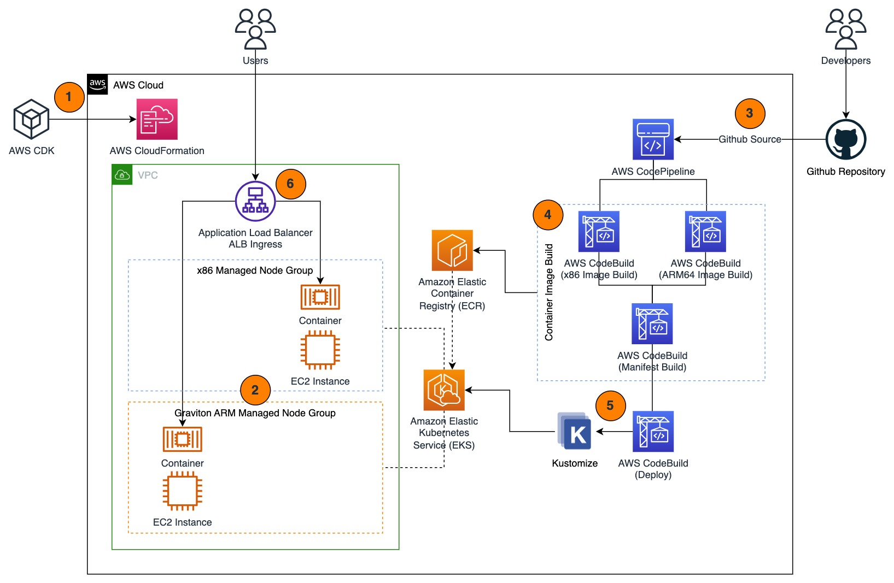

## AWS CDK EKS Multi-Arch for .NET Core Web Application

This repository contains examples on how to work with multi-arch Amazon EKS cluster, specifically for deploying .NET Core web application. 

A multi-arch EKS cluster consists of both x86 (Intel / AMD) and ARM (Graviton) worker nodes. One of the reasons why you might want to adopt multi-arch EKS cluster is to help ease the transition while moving your application from x86 architecture into ARM architecture powered by AWS Graviton. AWS Graviton2-based instance type offer up to 40% better price performance compared to fifth generation instances. AWS Graviton3 provide up to 25% better compute performance, up to 2x higher floating-point performance, and up to 2x faster cryptographic workload performance compared to AWS Graviton2 processors. Therefore adopting AWS Graviton in your architecture becomes a good way to improve performance and reduce costs.

Below are the things that you can use in this repository as references:
1. Deploy a multi-arch EKS cluster using EKS Blueprints
2. Create Dockerfiles for .NET Core web application for both x86-64 and arm-64 architecture.
3. Deploy CI/CD pipeline using AWS CodePipeline and AWS CodeBuild
4. Package multi-arch container images using container image manifest and then store it on Amazon ECR.
5. Deploy the application with latest image using Kustomize

---
## Architecture 

Below is the high-level architecture for this example.

1. All AWS resources in this example can be deployed automatically using AWS CDK. Behind the scenes, AWS CDK will use AWS CloudFormation to manage the deployment of the resources. You can check the code for CDK stacks in the `cdk` directory. In total there are 3 CDK stacks that will be deployed in this example.
2. The example will deploy an EKS cluster using EKS Blueprints with 2 managed node groups (MNG) for x86 and Graviton where each MNG contains 1 node. The blueprint is also configured to includes AWS Load Balancer Controller Add-on.
2. When all resources has been successfully deployed, CodePipeline will automatically run the first release for the pipeline where it will pull the source from Github repository. CodePipeline will also be triggered on any commits on the repository. To achieve this, the example will requires you to setup Github personal access token that will be explained in the deployment steps.
3. There are 2 stages in the image building process, the first stage is to build both x86 and ARM image architecture in parallel. Once completed, the second stage is to package both image into a single container image manifest. The image build process uses `docker build` and `docker manifest create`. All images and manifest will be stored on Amazon ECR. You can find the Dockerfiles used to build the container image for the application in the `DotnetCoreMultiArchApp` directory.
4. Once the latest image manifest is ready, the next stage in the pipeline is to deploy the application using the latest image version. Here, Kustomize is used to modify the container image placeholder in the original manifest file to use the latest image version. If this is the initial deployment, the deploy stage will also create all resources required by the web application including namespace, deployment, service, and ingress using Application Load Balancer. You can find the base Kubernetes manifest file used during the deployment in the `k8s` directory. The deployment resource will deploy 2 replicas for the pod with anti-affinity configuration, so it will be scheduled across the 2 nodes.
5. Once the deployment is completed, users can access the web application using the Application Load Balancer endpoint exposed using ALB Ingress. The sample web application prints the current node CPU architecture that is serving the request.

---
## Deployment

### 1. Prerequisites - Setup your Github Personal Access Token
1. In order for the deployment to work, you will need to fork this repository. Learn how to fork a repo from Github official docs [here](https://docs.github.com/en/get-started/quickstart/fork-a-repo).
2. Create a Github personal access token and store it on AWS Secrets Manager in the region that you plan to use.
    - The GitHub Personal Access Token should have these scopes:
        - repo - to read the repository
        - admin:repo_hook - to use webhooks
      Refer to this [AWS documentation](https://docs.aws.amazon.com/codepipeline/latest/userguide/appendix-github-oauth.html#GitHub-create-personal-token-CLI) and this [Github documentation](https://docs.github.com/en/authentication/keeping-your-account-and-data-secure/managing-your-personal-access-tokens) to learn how to create Github personal access token.
    - Copy the token and store it on AWS Secrets Manager in the region that you plan to use. Refer to this [documentation](https://docs.aws.amazon.com/secretsmanager/latest/userguide/create_secret.html) to learn more.
        - Use **Other type of secret** for the **Secret type**
        - Use **Plaintext** for the secret value
    - Note the secret name to be used in the next step
3. Clone the forked repository to your local machine. Refer to [this Github official documentation](https://docs.github.com/en/repositories/creating-and-managing-repositories/cloning-a-repository) for more details on how to clone a repo.

---
### 2. Prerequisites - Setup Tools
This guide assumes you are working on your own local machine.
1. If you haven't do so, install and configure AWS Command Line Interface (AWS CLI) with your AWS Identity and Access Management (IAM) user. Refer to [this documentation](https://docs.aws.amazon.com/cli/latest/userguide/cli-chap-getting-started.html) for more details.
2. If you haven't do so, [install AWS CDK](https://docs.aws.amazon.com/cdk/v2/guide/getting_started.html#getting_started_install).
3. If you haven't do so, [Install kubectl](https://docs.aws.amazon.com/eks/latest/userguide/install-kubectl.html).

---
### 3. Deploy CDK Stacks
1. Open `cdk/cdk.json` using your favorite text editor and do the following:
    - For `app-config/gitHubRepoOwner`, enter your Github username that you've used when you forked the repo.
    - For `app-config/gitHubRepo` and `app-config/gitHubRepoBranchName`, modify the Github repository name and branch name if required.
    - For `app-config/gitHubTokenAwsSecretsName`, enter the AWS Secrets Manager secret name that you've created on prerequisite steps.
    - Optionally, you can modify the cluster name and ECR repository name by modifying the `app-config/clusterName` and `app-config/ecrRepositoryName`
2. Open your preferred command line interface such as Terminal or Command Prompt.
3. Go to the source directory and traverse to CDK directory e.g. `cd cdk/`
4. Run `npm install`
5. Run `cdk bootstrap` to bootstrap CDK toolkit (you only need to perform this once).
6. Run `cdk deploy --all` to deploy the CDK stacks. Confirm the deployment prompt (y/n) for 3 stacks deployment, or you can add additional flag `--require-approval never` to let it deploy without confirmation.

### 4. Interact with Resources
1. Once the CDK stacks has been successfully deployed, open **AWS CodePipeline** on the AWS Management Console to monitor the build and deployment progress.
2. To configure your kubectl to interact with EKS cluster do the following:
    - Open **AWS CloudFormation** on AWS Management Console
    - Look for a stack named **eks-multi-arch-stack-eksblueprint**
    - In the **Outputs** tab of the stack, you can find and output with key `eksmultiarchstackeksblueprintConfigCommand` that contains `aws eks update-kubeconfig` command to configure your local kubeconfig file to connect to the cluster.
3. Use `kubectl get ingress -n multi-arch-app` to get the Application Load Balancer endpoint created using ALB ingress during deployment. 
4. You can use the ALB endpoint to access the sample web application. The sample web application will print the current node CPU architecture of the pod that is serving the request which is either `X64` or `Arm64`.

---
## Cleanup
You should consider deleting the CDK stacks once you no longer need it to save costs. To do that, follow these steps:

1. Open your preferred command line interface such as Terminal or Command Prompt.
2. From the top directory of the source code, go to the CDK directory: `cd cdk`
3. Run `cdk destroy --all` to delete the CDK stacks and then confirm the deletion.

---
## Security

See [CONTRIBUTING](CONTRIBUTING.md#security-issue-notifications) for more information.

---
## License

This library is licensed under the MIT-0 License. See the LICENSE file.

